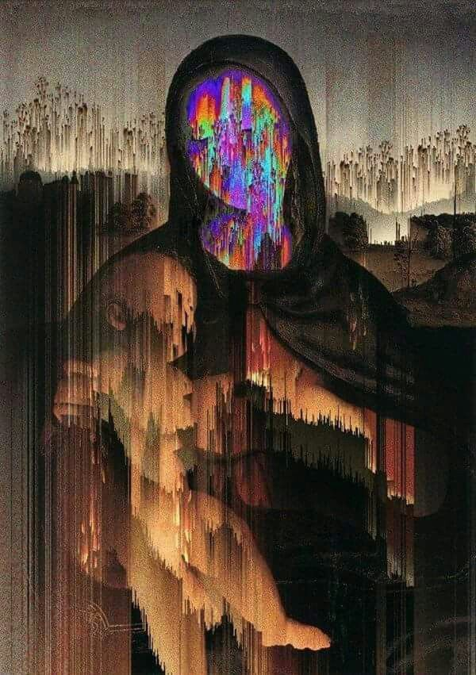
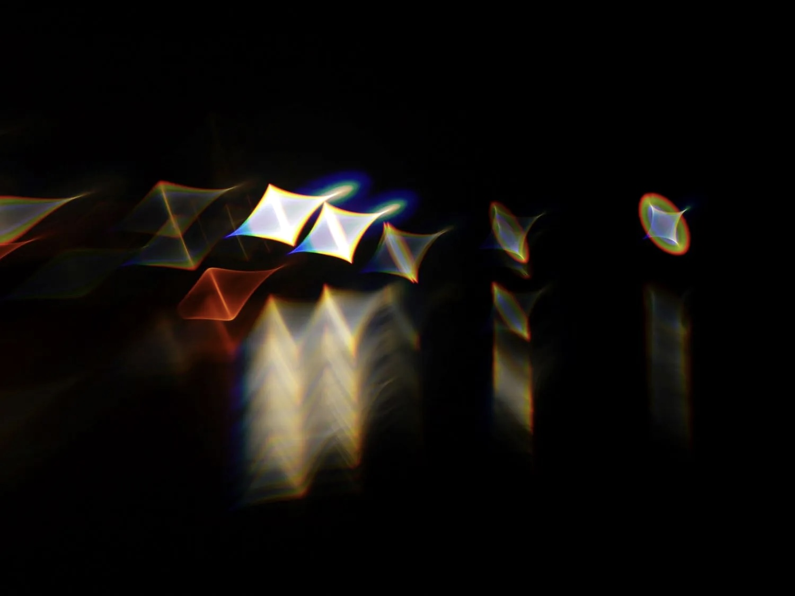
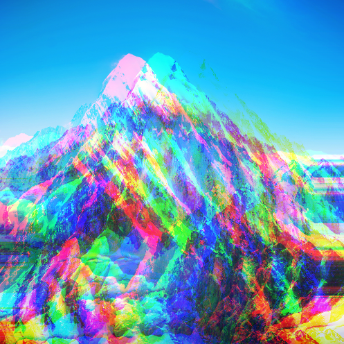

# Quiz 8: Design Research 

## Part 1: Imaging Technique Inspiration
**Inspiration Source:** Digital Glitch and Chromatic Aberration in Thriller Media

I am inspired by the digital distortion, scanlines, and chromatic aberration (RGB colour splitting) shown in these examples. I want to incorporate this chaotic, degraded visual style into my project to evoke psychological tension and unease. Considering the assignment requirements, this is a highly beneficial technique because it transforms static imagery into an unstable, interactive environment. It perfectly sets the unsettling mood I aim to achieve and provides a clear visual feedback mechanism for when the system reacts to external inputs.

**Screenshots:**

*(Note: Example of erratic digital distortion and tracking errors)*

*(Note: Example of RGB colour separation and pixel displacement)*

---

## Part 2: Coding Technique Exploration
**Technique Name:** Pixel Manipulation (`img.get()`) & Time/Audio Driven Displacement

To achieve this glitch effect, I will build upon the pixel manipulation and Object-Oriented Programming (OOP) techniques we learned in Week 8. Instead of drawing accurate coloured rectangles, I can extract pixel data using `img.get(x,y)` and deliberately offset the RGB channels spatially. To integrate my chosen mechanics, this displacement amount will be driven dynamically: using `millis()` to trigger rhythmic, unpredictable glitches over time, or mapping `mic.getLevel()` to cause violent chromatic aberrations in response to loud noises. This programmatic corruption of image data dynamically builds the project's tense atmosphere.

**Code Example:**
- **Live Demo & Code:** [Interactive Chromatic Aberration](https://editor.p5js.org/aferriss/sketches/Vf-h3VgO4) (Example by aferriss)

**Action Screenshot:**
